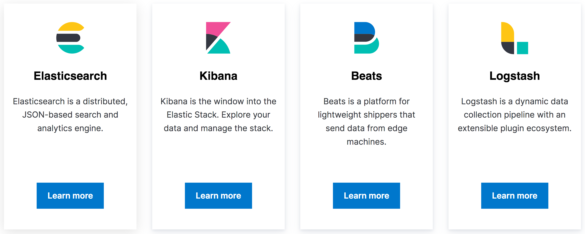

theme: Fira Elastic
footer: 
autoscale: true

## Hands-on introduction to Elasticsearch

###  Emanuil Tolev　　　@emanuil_tolev

---

# 
## Community Engineer

---

^ Large open source projects: Elasticsearch, Kibana, Beats and Logstash
^ At the heart is Elasticsearch, an open source search and data analytics engine.
^ Kibana is an open source visualisations and dashboarding tool
^ The rest support logging, metrics and tracing, a use case with 1000s of big company and millions of smaller users.
^ "Meet the open source tools that power experiences from the search for life on Mars to finding the best sushi in your neighborhood."
^ All very well, but what does it have to do with data science?

---

## How big is your Jupyter notebook?

---

## How long is a piece of string...

^ It depends. But generally, with recent software versions, it depends on your computer. On your own desktop or laptop.
^ A notebook is very difficult to distribute. So is computation from a Jupyter notebook.
^ Some computations can be distributed with existing toolkits. Without getting into comparisons, some people have found such tooling difficult to configure, plus the leap from own laptop to production env is large. Elastic sits at a balance between easy to distribute and (less) features than Jupyter which has all of Python, R and Julia.

---

## Elasticsearch scales horizontally - you can add more pieces

^ & thus memory/CPU/etc. Its strength is the easy addition and coordination with new nodes. Your computations can scale as much RAM as a whole cluster, but the interface and commands you use remain as if it were just one node on your laptop.

---

#  Use in production

- Search (online shop front, admin tooling, recommendation systems, ...)
- Analytics (business metrics)
- Web app monitoring: "Logging, Metrics, Traces"
- Interactive dashboarding
- Unsupervised learning for anomaly detection (paid! but good)
- Now security too

^ If you're a data scientist, you may be asked to analyse any of this data, so it's useful to know what it's typically used for. You can google for most of these and get help from your peers.

---

## The Search experience

- It’s more than a back-end to install and connect to

- Full-stack view: great UX is the goal

- Relevance, ranking, speed

- Of course you do also need a back-end :)

^ Just in case you do get asked to build a search experience of some kind. Surprisingly common task.

---

## Today

- Setup and connect
- Index (put data in)
- Query (get data out - search and aggregate)
- Use Kibana to create a few visualisations
- Et voila!

---

## https://github.com/emanuil-tolev/es-hands-on-intro

- for those who haven't done it yet, docker-compose up and then run ./build.sh to inject sample data
- follow demo-console.txt in http://localhost:5601/app/kibana#/dev_tools/console
- later we'll play with Kibana, the vis GUI!

^ Copy paste lines 1 by 1, we'll go through them later.
^ The crux of this is that you learn how Elasticsearch works. Data comes in from one side. By default, it's analysed (tokenised and then normalised, including lowercasing). The same things happen to data on the other side - your queries coming in. So long as both the data is analysed and the queries are analysed with the same algorithm, everything is fine, we have a match. This is with a Match query. Now, we can turn off analysis for queries coming in - with a Term query. This allows us to search for the analysed indexed data directly. It's useful for things like getting the top 10 most popular tags - or anything that's an exact string rather than normal full text search.
---

## https://github.com/emanuil-tolev/es-hands-on-intro

- create a pie chart showing how many women are in the dataset, grouped by country
- create a chart showing how many men born before 1950 are interested in marketing.music (that we know of)
- create 1 bar chart, 1 pie chart and 1 area graph of your choosing
- if you have time, try the TSVB visualisation (visual builder). What fields seem appropriate to use here?

---

# Questions?
### Emanuil Tolev　　　　　@emanuil_tolev
### etolev@elastic.co
